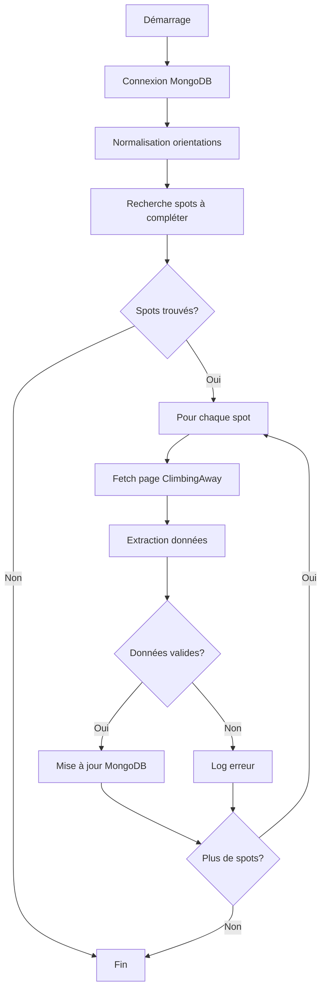

# Changelog - Traitement Orientation & Niveaux des Spots

## 📅 Date : 2025-10-23

### 🎯 Objectif

Implémenter un système automatique pour extraire et normaliser les données d'orientation et de niveaux des spots d'escalade depuis ClimbingAway.fr.

## 🆕 Nouveaux fichiers créés

### Scripts Backend

1. **`/workspace/backend/scripts/update-spot-data.js`**
   - Script principal de mise à jour
   - Normalisation des orientations
   - Extraction depuis ClimbingAway
   - Protection des données existantes
   - Rate limiting (1s entre requêtes)
   - Limite de 50 spots par exécution

2. **`/workspace/backend/scripts/test-extraction.js`**
   - Script de test pour diagnostiquer l'extraction
   - Test sur l'exemple "École d'Escalade de Pont Julien"
   - Affichage détaillé de la structure HTML
   - Analyse des résultats

3. **`/workspace/backend/scripts/README.md`**
   - Documentation du répertoire scripts
   - Explications techniques
   - Guide d'utilisation

### Documentation

4. **`/workspace/GUIDE_RAPIDE_UPDATE_SPOTS.md`**
   - Guide de démarrage rapide
   - Exemples d'utilisation
   - Workflow recommandé
   - Résolution de problèmes

5. **`/workspace/SCRIPT_UPDATE_SPOTS.md`**
   - Documentation technique complète
   - Structure des données
   - Limitations et sécurité
   - Fréquence recommandée

6. **`/workspace/RECAPITULATIF_SOLUTION.md`**
   - Vue d'ensemble de la solution
   - Impact visuel
   - Checklist complète

7. **`/workspace/CHANGELOG_ORIENTATION_NIVEAUX.md`** (ce fichier)
   - Journal des modifications

## 🔧 Fichiers modifiés

### `/workspace/backend/package.json`

**Ajout de dépendance :**
```json
"cheerio": "^1.0.0"
```

**Ajout de scripts npm :**
```json
"scripts": {
  "update-spots": "node scripts/update-spot-data.js",
  "test-extraction": "node scripts/test-extraction.js"
}
```

## 📊 Données traitées

### Champs concernés

| Champ | Avant | Après | Localisation |
|-------|-------|-------|--------------|
| `orientation` | `""` | `"SE"`, `"S"`, `"NE"`, etc. | Racine du document |
| `niveau_min` | `""` | `"4"`, `"6a"`, `"7b+"`, etc. | Racine du document |
| `niveau_max` | `""` | `"7c"`, `"8a"`, `"9a"`, etc. | Racine du document |

### Migration de l'orientation

```javascript
// Avant
{
  "orientation": "",
  "info_complementaires": {
    "orientation": "SE"
  }
}

// Après
{
  "orientation": "SE",  // ← Normalisé
  "info_complementaires": {
    "orientation": "SE"
  }
}
```

## 🔄 Processus de traitement



## ⚙️ Caractéristiques techniques

### Sécurité et performance

- ✅ **Rate limiting** : 1 seconde entre chaque requête HTTP
- ✅ **Limite de traitement** : 50 spots maximum par exécution
- ✅ **Protection des données** : Ne remplace jamais les données existantes
- ✅ **Gestion d'erreurs** : Les échecs n'arrêtent pas le processus
- ✅ **Logging détaillé** : Trace complète des opérations

### Extraction de données

**Méthodes utilisées :**
1. Recherche dans les paires `<dt>`/`<dd>`
2. Recherche dans les tableaux `<table>`
3. Recherche par regex dans le texte brut

**Patterns supportés :**
- Orientation : `N`, `S`, `E`, `W`, `NE`, `NW`, `SE`, `SW`, etc.
- Niveaux : `4`, `6a`, `7c+`, format "min à max"

## 🧪 Tests et validation

### Validation syntaxique

```bash
✅ node --check scripts/update-spot-data.js
✅ node --check scripts/test-extraction.js
```

### Test d'extraction

```bash
npm run test-extraction
```

**Sortie attendue :**
- Page chargée avec succès
- Données extraites affichées
- Structure HTML analysée
- Diagnostic complet

## 📈 Impact sur l'application

### Backend

**Routes affectées :**
- `GET /api/spots` - Inclut orientation et niveaux dans la projection
- `GET /api/spots/near` - Idem
- `GET /api/advice/spots` - Utilise l'orientation pour le filtrage

**Collections MongoDB :**
- `climbing_spot` - Champs mis à jour automatiquement

### Frontend

**Fichiers utilisant les données :**
- `/workspace/frontend/js/map.js` - Affichage dans la fiche spot
- `/workspace/frontend/js/api.js` - Normalisation côté client (fallback)
- `/workspace/frontend/js/materiel-enhanced.js` - Recommandations

**Fonctionnalités améliorées :**
- 🎨 Fiche spot plus complète (orientation + niveaux affichés)
- 🔍 Filtrage par orientation fonctionnel
- 📍 Icônes dynamiques selon le niveau
- 🎯 Recommandations plus précises

## 🎨 Exemple visuel

### Fiche spot avant
```
┌─────────────────────────────────┐
│ 📍 École de Pont Julien         │
├─────────────────────────────────┤
│ Type : 🧗 crag                  │
│ Sous-type : dif                 │
│                                 │
│ [📄 Fiche] [🚗 Itinéraire]      │
└─────────────────────────────────┘
```

### Fiche spot après
```
┌─────────────────────────────────┐
│ 📍 École de Pont Julien         │
├─────────────────────────────────┤
│ Type : 🧗 crag                  │
│ Sous-type : dif                 │
│ Niveau : 4 à 7c                 │ ← NOUVEAU
│ Orientation : SE                │ ← NOUVEAU
│                                 │
│ [📄 Fiche] [🚗 Itinéraire]      │
└─────────────────────────────────┘
```

## 📝 Instructions d'utilisation

### Installation
```bash
cd /workspace/backend
npm install
```

### Premier test
```bash
npm run test-extraction
```

### Exécution complète
```bash
npm run update-spots
```

### Vérification
```bash
# MongoDB
mongo grimpe
db.climbing_spot.find({ orientation: { $ne: "", $ne: null } }).count()

# Application web
# Ouvrir map.html et cliquer sur un spot
```

## 🔮 Améliorations futures possibles

### Court terme
- [ ] Augmenter la limite de spots traités (actuellement 50)
- [ ] Ajouter plus de patterns de reconnaissance
- [ ] Supporter d'autres formats de cotations

### Moyen terme
- [ ] Interface web pour déclencher la mise à jour
- [ ] Export des modifications en CSV
- [ ] Validation manuelle avant mise à jour
- [ ] Statistiques détaillées

### Long terme
- [ ] Support de sources multiples (camptocamp, ffme, thecrag)
- [ ] Machine learning pour l'extraction
- [ ] API publique pour contribuer aux données
- [ ] Traitement en temps réel lors de l'ajout de spots

## 🐛 Bugs connus

Aucun bug connu à ce jour.

## ⚠️ Notes importantes

1. **Dépendance externe** : Le script dépend de la structure HTML de ClimbingAway.fr qui peut changer sans préavis
2. **Rate limiting** : Respecter la limite de 1 seconde entre requêtes
3. **Données partielles** : Tous les spots n'ont pas forcément des données complètes sur ClimbingAway
4. **Ré-exécution** : Il peut être nécessaire d'exécuter le script plusieurs fois pour traiter tous les spots (limite de 50)

## ✅ Checklist de déploiement

- [x] Scripts créés et testés
- [x] Dépendances ajoutées au package.json
- [x] Documentation complète rédigée
- [x] Validation syntaxique effectuée
- [x] Structure de données vérifiée
- [x] Compatibilité backend/frontend assurée
- [x] Guides d'utilisation créés

## 📞 Contact et support

Pour toute question ou problème :
1. Consulter les fichiers de documentation
2. Exécuter le script de test
3. Vérifier les logs détaillés

## 🎉 Résumé

**Fonctionnalité ajoutée :** Extraction automatique des orientations et niveaux des spots d'escalade depuis ClimbingAway.fr

**Impact :** 
- Données plus complètes dans la base
- Meilleure expérience utilisateur
- Filtrage et recommandations plus précis

**Maintenabilité :**
- Code modulaire et documenté
- Scripts npm faciles à exécuter
- Documentation exhaustive

---

**Status : ✅ Prêt pour utilisation**

**Version : 1.0.0**

**Date : 2025-10-23**
